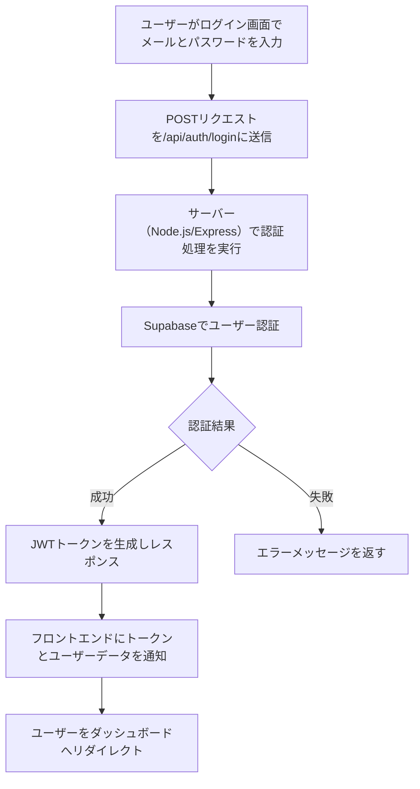
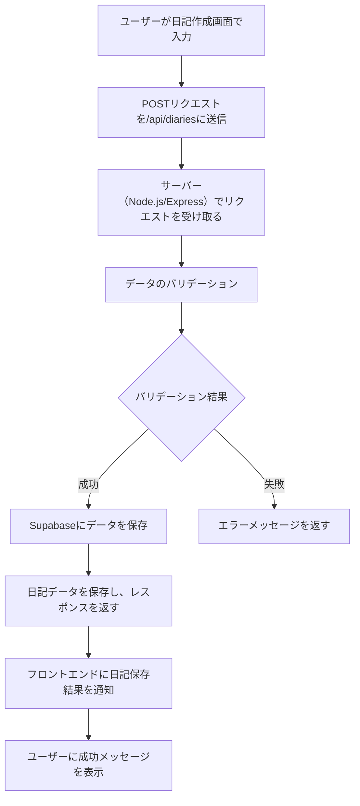

# バックエンド要件

## 使用技術
- **バックエンドサービス**: Supabase
  - データベース（PostgreSQL）、認証、ストレージ機能を利用。
- **サーバー**: Node.js（Express.js）
  - APIサーバーとして、フロントエンドと連携。
- **データベース**: PostgreSQL
  - 日記データ、ユーザーデータを保存。

---

## APIエンドポイント
### 1. ユーザログイン API
- **エンドポイント**: `/api/diaries`
- **メソッド**: `POST`
- **リクエストボディ**:
```json
{
  "email": "user@example.com",
  "password": "password123"
}
```
- **レスポンス例**:
```json
{
  "message": "Login successful",
  "token": "jwt_token",
  "user": {
    "id": 1,
    "email": "user@example.com"
  }
}
```


### 2. 日記作成 API
- **エンドポイント**: `/api/diaries`
- **メソッド**: `POST`
- **リクエストボディ**:
```json
  {
    "title": "日記のタイトル",
    "content": "日記の本文",
    "image_url": "画像のURL"
  }
```
- **レスポンス例**:
```json
  {
  "id": 1,
  "title": "日記のタイトル",
  "content": "日記の本文",
  "image_url": "画像のURL",
  "created_at": "2025-01-05T12:00:00Z"
}
```
## フロー図
### ログイン API フロー図

### 日記作成 API フロー図

