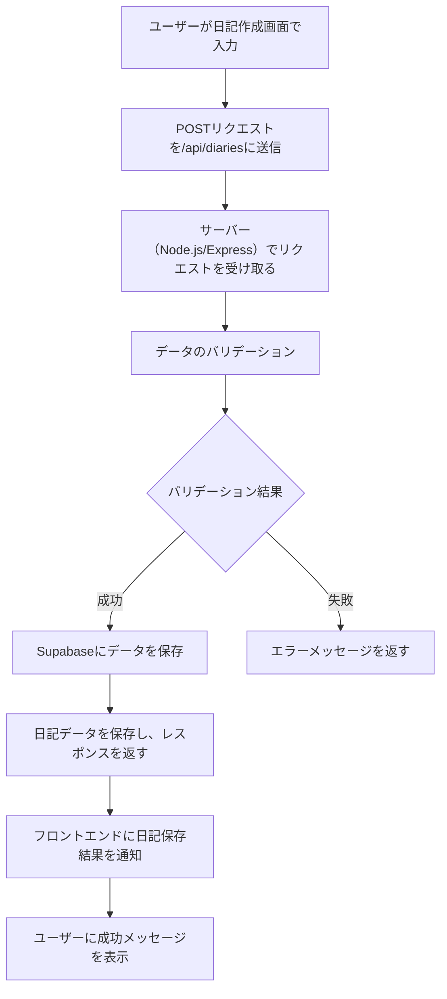

# バックエンド要件

## 使用技術
- **バックエンドサービス**: Supabase
  - データベース（PostgreSQL）、認証、ストレージ機能を利用。
- **サーバー**: Node.js（Express.js）
  - APIサーバーとして、フロントエンドと連携。
- **データベース**: PostgreSQL
  - 日記データ、ユーザーデータを保存。

---

## APIエンドポイント

### 1. 日記作成 API
- **エンドポイント**: `/api/diaries`
- **メソッド**: `POST`
- **リクエストボディ**:
  ```json
  {
    "title": "日記のタイトル",
    "content": "日記の本文",
    "image_url": "画像のURL"
  }
  {
  "id": 1,
  "title": "日記のタイトル",
  "content": "日記の本文",
  "image_url": "画像のURL",
  "created_at": "2025-01-05T12:00:00Z"
}
### フロー図

