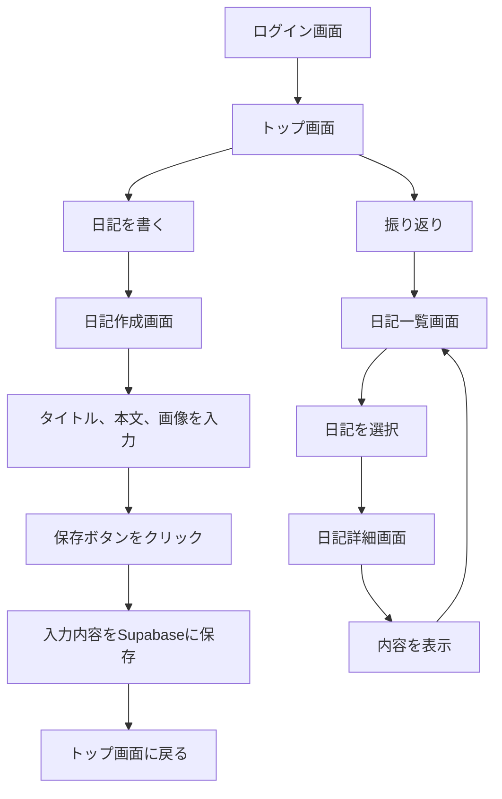
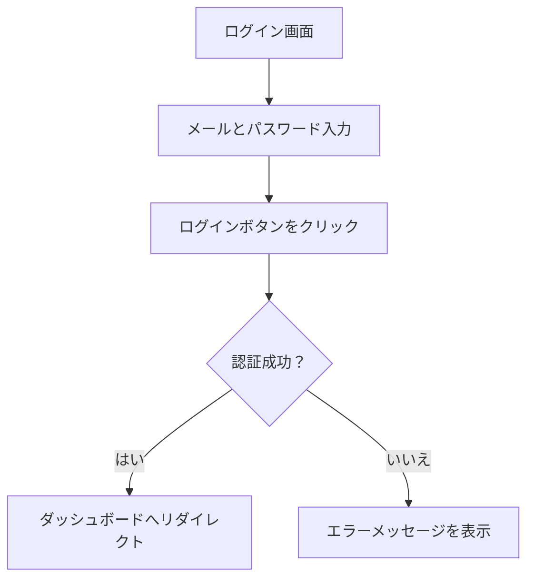

## アプリ概要
### アプリ名：日抄（にっしょう）
## 概要
日抄は日々の出来事や感想をシンプルに記録し、振り返ることができる日記アプリです。直感的なインターフェースと使いやすさを重視し、テキストだけでなく画像の添付も可能です。保存した日記は編集できないようにすることで、その時の気持ちをそのまま残せる仕様となっています。

## 機能
### タイトルと本文の記述
ユーザーは日記のタイトルと本文を自由に記述できます。本文には文字制限がないため、詳細な記録が可能です。

### 画像の挿入
日記に画像を添付することで、文章だけでは伝わりにくい記憶や出来事を視覚的に表現できます。

### 保存機能
日記を保存すると、投稿順に整理され、後から閲覧できます。保存後の編集はできないため、記録時の心境をそのまま保存できます。

### 閲覧機能
保存された日記を一覧表示し、個別に閲覧することができます。過去の日記を振り返り、成長や変化を確認できます。

### 対象ユーザー
自己振り返りを行いたい人：自身の成長や変化を記録して後から見返したい人。
### フロー図

## ログイン機能の概要
### フロー図

### コード概要
ログイン画面では、ユーザーがメールアドレスとパスワードを入力し、Supabaseの認証サービスを利用して認証を行います。認証に成功するとダッシュボードにリダイレクトされ、失敗した場合はエラーメッセージが表示されます。

## 使用技術
### フロントエンド: Next.js、React、Tailwind CSS
### バックエンド: Supabase（PostgreSQL、認証、ストレージ）
