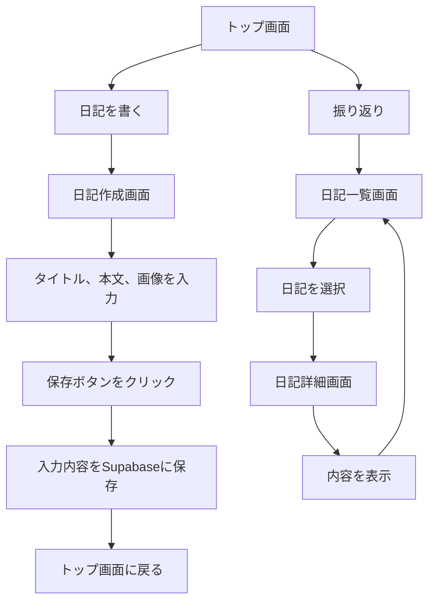

# アプリ概要
## アプリ名：日抄（にっしょう）
## 概要
このアプリは日々の出来事や感想をシンプルに記録し、振り返ることができる直感的な日記アプリです。シンプルなインターフェースと使いやすさを重視し、文章だけでなく画像の挿入も可能です。一度保存した日記は後から書き換えることができないように設定されています。
## 機能
### タイトルと文章の記述
ユーザは日記のタイトルと本文を自由に書き込むことができます。本文は文字制限がないため、思う存分記録することが可能です。
### 画像の挿入
記録に画像を添付することができます。写真を使って、日記をより豊かに表現でき、例えば風景や食事、特別な瞬間を記録することができます。
### 保存機能
日記を保存すると、記録順に整理され、後から閲覧できるようになります。保存後の編集はできないため、その時の気持ちや感情をそのまま残すことができます。
### 閲覧機能
保存した日記を一覧表示し、個別に閲覧することができます。日記を振り返りながら、時間とともに変化した心境や思考を見直すことが可能です。
## 対象ユーザ
### 自己振り返りしたい人
自分の成長や変化を後から見返したい人。
## フロー図

